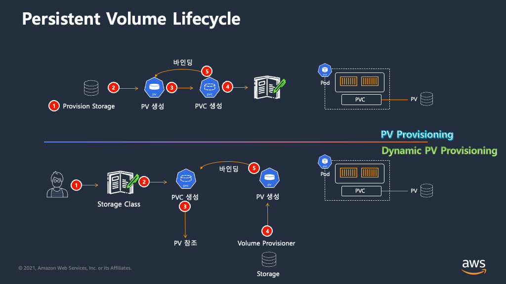

## K8S storage overview


### Local Volume
* hostPath : 호스트와 볼륨을 공유하기 위함
* emptyDir : 파드의 컨테이너간 볼륨을 공유하기 위함, 파드가 삭제되면 emptyDir에 저장된 데이터도 삭제됨
* 둘 다 특별한 경우가 아니라면 자주 사용되지는 않음

### Persistent Volume (PV)
* pod와 독립적으로 존재하는 리소스
* 관리자가 프로비저닝하거나 StorageClass(스토리지 클래스)를 사용하여 동적으로 프로비저닝
* 파드를 위해 스토리지 설정을 직접 yaml에 설정할 수 있으나, 스토리지의 종류마다 볼륨 타임의 세부 명세가 다름
* 따라서, 이를 추상화하면 파드는 볼륨의 세부사항을 몰라도 볼륨을 사용할 수 있음
* Reclaim Policy : Retain/Delete가 있음.
  * Delete인 경우 실제 볼륨 뿐만 아니라 오브젝트도 삭제
  * Retain인 경우 VPC와 바인딩은 삭제되지만 PV는 유지

### Persistent Volume Claim (PVC)
* 데이터를 영속적으로 저장해야 하므로, 마운트할 수 있는 외부 볼륨이 필요하다라는 의미
* PVC(Persistent Volume Claim)는 검색 조건과 유사, 동일한 조건과 매칭되는 pv만 연결됨.
* PVC와 일치하는 PV가 존재하면 둘을 바인딩하여 파드가 PV를 사용할 수 있게 됨
* 라벨일뿐 실제 볼륨의 그 속성을 가지는 것은 아님. (예, storage: 5Gi라고 했을 때, 실제 5Gi만 생성것은 아님.. 그냥 조건자일 뿐)

### Access Mode
* ReadWriteMany : 1:N 마운트 가능, 읽기/쓰기 가능
* ReadOnlyMany : 1:N 마운트 가능, 읽기 전용
* ReadWriteOnce : 1:1 마운트만 가능, 읽기/쓰기 가능 (EBS 연결시 등에 사용)

### Volume 실습
* 두개의 컨테이너를 가지는 pod 생성
* 두 컨테이너는 모두 동일한 볼륨을 마운트
* 하나의 컨테이너에서 test.html 생성
* 다른 컨테이너에서 test.html을 확인
```yaml
cd ~/environment
  cat << EOF > empty-dir-pod.yaml
apiVersion: v1
kind: Pod
metadata:
  name: emptydir-pod
spec:
  containers:
    - name: content-creator
      image: alicek106/alpine-wget:latest
      args: ["tail", "-f", "/dev/null"]
      volumeMounts:
        - mountPath: /data
          name: my-emptydir-volume
    - name: apache-webserver
      image: httpd:2
      volumeMounts:
        - mountPath: /usr/local/apache2/htdocs/
          name: my-emptydir-volume
  volumes:
    - name: my-emptydir-volume
      emptyDir: {}
EOF

kubectl apply -f emptydir-pod.yaml
```
```shell
kubectl get pod -n default emptydir-pod
```
```shell
kubectl exec -it emptydir-pod -c content-creator sh 
```
```shell
echo Hello, dobal >> /data/test.html
exit
```
```shell
kubectl exec -it emptydir-pod -c apache-webserver sh
```
```shell
cat /usr/local/apache2/htdocs/test.html
```
```shell
kubectl delete -f ./empty-dir-pod.yaml 
```
### PV, PVC 실습
#### EBS volume 생성
```shell
export VOLUME_ID=$(aws ec2 create-volume \
    --availability-zone us-west-2a \
    --size 5 \
    --volume-type gp3 \
    --tag-specifications 'ResourceType=volume,Tags=[{Key=kubernetes.io/cluster/eks-workshop,Value=owned}]' \
    --query 'VolumeId' \
    --output text)
```
```yaml
cd ~/environment
mkdir ebs-pv-pod
cd ebs-pv-pod
cat << EOF > ebs-pv.yaml
apiVersion: v1
kind: PersistentVolume
metadata:
  name: ebs-pv
spec:
  capacity:
    storage: 10Gi
  volumeMode: Filesystem
  accessModes:
    - ReadWriteOnce
  awsElasticBlockStore:
    fsType: ext4
    volumeID: "{$VOLUME_ID}"
EOF
```
```shell
kubectl apply -f ebs-pv.yaml
kubectl get pv -n default
```
```yaml
cat << EOF > ebs-pvc-pod.yaml
apiVersion: v1
kind: PersistentVolumeClaim
metadata:
  name: ebs-pvc
spec:
  accessModes:
    - ReadWriteOnce
  storageClassName: ""
  resources:
    requests:
      storage: 5Gi
---
apiVersion: v1
kind: Pod
metadata:
  name: ebs-pod
spec:
  containers:
    - name: ebs-mount-container
      image: httpd:2
      volumeMounts:
        - name: ebs-volume
          mountPath: /data
  volumes:
    - name: ebs-volume
      persistentVolumeClaim:
        claimName: ebs-pvc
EOF
```
```shell
kubectl apply -f ebs-pvc-pod.yaml
```
* pvc의 조건들과 일치할 때만 pv 연결

## Amazon EBS
### StatefulSets
* deployments와 유사하지만, 각 pod의 ID가 고정
* 데몬셋처럼 특수한 형태의 레플리카셋
* Scale명령도 replica와 유사
* 생성된 pod명 접미사에 숫자(0번 부터)가 부여
* 기본적으로 앞선 숫자의 pod부터 차례대로 생성
* pod명이 바뀌지 않음 (persistent identifier) → 재배포시에도 동일한 pod명(식별자)
* 데이터를 영구적으로 저장하기 위한 구조
* <podName-일련번호>.<serviceName> 형식으로 접근 가능
* 본 예제에서는 EKS상에서 실행중인 MySQL DB를 이용하는 Catalog DB 서비스를 StatefulSet으로 배포  
  ```sh
  kubectl get pod -n catalog
  kubectl logs -n catalog catalog-mysql-0 --tail 5
  kubectl get pod -n catalog catalog-mysql-0 -o jsonpath='{.metadata.labels}{"\n"}' | jq
  ```  
  

#### Volumes - emptyDir
  * 파드의 볼륨은 파드 내의 컨테이너들 모두 읽기/쓰기가 가능
  * 파드 생성시 기본으로 할당되는 emptyDir 볼륨의 수명은 파드의 수명과 같이하여 노드에서 파드가 제거되면 emtpyDir내의 데이터도 영구히 삭제
  * 영구적인 저장 장치가 필요한 DB 용도에는 EmptyDir은 적달하지 않음
  * 실습에서는 MySQL container 내의 emptyDir에 파일을 생성한 뒤, 파드를 삭제 및 재시작하여 emptyDir내 파일이 살아있는지 확인
    ```
    kubectl exec catalog-mysql-0 -n catalog -- bash -c  "echo 123 > /var/lib/mysql/test.txt"
    ```
    ```
    kubectl exec catalog-mysql-0 -n catalog -- ls -larth /var/lib/mysql/ | grep -i test
    ```
    ```
    kubectl delete pods -n catalog -l app.kubernetes.io/component=mysql
    ```
    ```
    kubectl wait --for=condition=Ready pod -n catalog \
    -l app.kubernetes.io/component=mysql --timeout=30s
    kubectl get pods -n catalog -l app.kubernetes.io/component=mysql
    ```
    ```
    kubectl exec catalog-mysql-0 -n catalog -- cat /var/lib/mysql/test.txt
    ```

### EBS CSI Driver
* Kubernetes Container Storage Interface(CSI) Driver는 클러스터의 PV를 관리하기 위한 인터페이스를 제공
* EBS csi driver도 pod로 실행되며, EBS API 호출을 위한 권한이 있어야 함
* Amazon EBS CSI driver는 EKS 클러스터에서 EBS를 PV로 사용할 수 있도록 해줌
* 클러스터에 add-on으로 설치, 각 노드에서 데몬셋으로 동작

### StorageClass & Dynamic Provisioning
* PV를 항상 미리 생성하고, yaml에 기입해야 사용할 수 있음, 준비가 안되다면 에러
* PVC에 기술된 조건과 일치하는 PV가 없을 경우, 자동으로 PV 생성 및 AWS EBS도 함께 생성하는 동적 프로비저닝 쌉가능
* volumeClaimTemplates : Amazon EBS, PV, PVC를 모두 자동으로 생성

### StatefulSet with EBS Volume


* catalog component에서 EBS volume을 이용하는 신규 MySQL용 StatefulSet을 생성
* 생성된 statefule에 대한 service 생성
* 배포 후 storageclass, pvc, pv 확인

    ```shell
    kubectl get storageclass,pv,pvc -n catalog
    ```
## Amazon EFS
### Persistent network storage
* 이미지 파일을 가지는 파드들이 있으며, 새로운 이미지가 추가될 때마다 파드를 다시 배포해야 하는 상황
* EFS와 PV를 이용하여 파드 배포 없이도 이미지를 추가할 수 있도록 하는 예제
* 컨테이너 빌드시 `/usr/share/nginx/html/assets` 폴더에 이미지가 복사됨
* assets의 replicas=2로 한 뒤, 첫 번째 파드에 새로운 이미지를 생성
* 두 번째 파드에는 해당 이미지가 없다는 것을 보여줌

### EFS CSI Driver
* Amazon EBS와 같이 클러스터에서 AWS 리소스를 핸들링하려면 드라이버와 권한이 필요
* Amazon EFS는 이미 하나 만들어져 있음 (콘솔 확인)

## References
* [Kubernetes를 위한 영구 스토리지 적용하기](https://aws.amazon.com/ko/blogs/tech/persistent-storage-for-kubernetes/)
